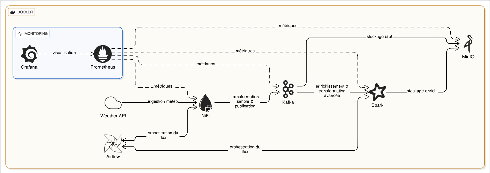

# 🌦️ Real-Time Weather Big Data Pipeline

## Project Description

This project implements a **real-time Big Data pipeline** for monitoring and analyzing weather data.
It continuously collects meteorological data from a Weather API, processes it through streaming technologies, stores raw and processed data in a Data Lake, and provides full system observability.

The entire system is **fully containerized using Docker**.

---

##  Architecture



## Technologies Used

* Apache NiFi
* Apache Kafka
* Apache Spark (Streaming)
* MinIO (S3-compatible Data Lake)
* Apache Airflow
* Prometheus
* Grafana
* Docker & Docker Compose
* Python

---


## Environment Variables (.env)

This project uses environment variables to protect sensitive data such as API keys.

### 1️⃣ Create `.env` file


### 2️⃣ Add your Weather API key

```env
WEATHER_API_KEY=your_weather_api_key_here
```


## Python Dependencies (Spark)

All Python dependencies used by Spark are listed in `requirements.txt`.
```
pip install -r requirements.txt
```


## Docker Setup & Execution

### 1️⃣ Build Spark Docker Image

Spark has its own `Dockerfile`. Build it using:

```bash
docker build 
```

---

### 2️⃣ Start the Entire Pipeline

Run all services using Docker Compose:

```bash
docker-compose up -d
```

This will start:

* NiFi
* Kafka & Zookeeper
* Spark
* MinIO
* Airflow
* Prometheus
* Grafana

---

### 3️⃣ Verify Running Containers

```bash
docker ps
```

---


## Monitoring

* **Prometheus** collects metrics from:

  * Apache NiFi
  * Apache Kafka
  * Apache Spark
  * MinIO
* **Grafana** visualizes:

  * Throughput
  * Latency
  * Resource usage
  * Pipeline health

---


